# Demo — UrlAgent

UrlAgent is two things in one repo: a URL shortener API, and a homemade SDLC orchestrator that
drives work through a hand-written Python DAG. The orchestrator stops at human gates instead of
shipping on its own. Everything runs from `docker compose up --build`. Built with Cursor.

Total time: about 10 minutes. Commands below are bash on macOS.

## Prerequisites

Docker Desktop must be running. Clone the repo and start the stack from the repo root.

```bash
git clone https://github.com/gitcheckout1/UrlAgent.git
cd UrlAgent
docker compose up --build
```

Leave that terminal running. Open a second terminal for the rest of the demo.

## Moment 1 — Shortener works (~2 min)

Open http://localhost:8000/docs

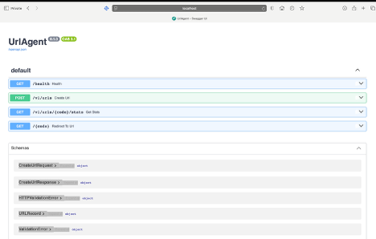

Say: "The API creates a short code and returns 201."

Expand `POST /v1/urls`, click Try it out, and send:

```json
{"url": "https://www.google.com"}
```

The response is 201 with a seven-character code.

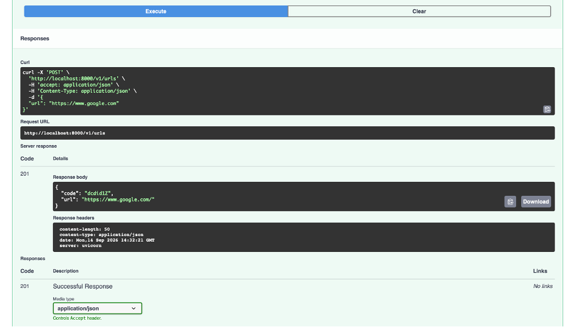

Only `http` and `https` are accepted. `javascript:` and `ftp:` return 400.

Check the redirect from the command line. Replace `CODE` with the code from the 201 response.

```bash
curl -s -D - -o /dev/null --max-redirs 0 http://localhost:8000/CODE
```

The response is 302 with a `Location` header.

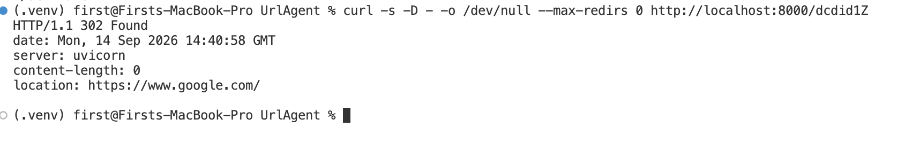

Two things to expect here. A browser follows the redirect and jumps away from the page. Swagger's
Try it out on `GET /{code}` fails for external URLs, because the redirect leaves the docs origin.
Both are normal. Use `curl` or the address bar to see the redirect.

## Moment 2 — Orchestrator stops (~3 min)

```bash
docker compose run --rm api python -m orchestrator run scenarios/greenfield.yaml --run-id demo1
echo $?
```

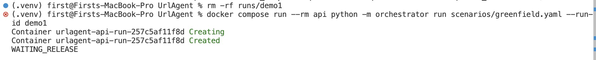

The run walks requirements, design, three implement nodes, join, test and docs, then halts before
release and writes a marker file.

```bash
cat runs/demo1/WAIT_RELEASE.json
```

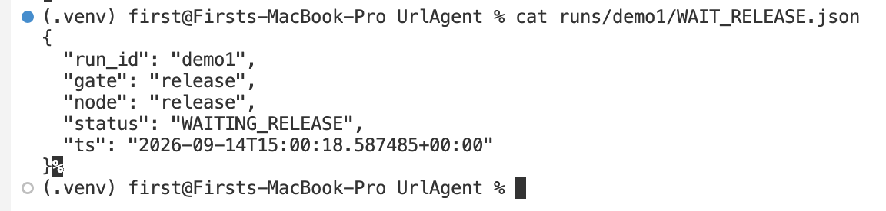

Say: "The status is WAITING_RELEASE on purpose. Nothing ships without a human."

A non-zero exit here is the gate, not a crash. Exit **2** means the run reached the human gate and stopped cleanly. Artifacts and state stay on disk under `runs/demo1/`.

## Moment 3 — Approve and finish (~2 min)

Approval is a separate command, run by a human. Then the same run id is executed again.

```bash
docker compose run --rm api python -m orchestrator approve --gate release --run-id demo1
docker compose run --rm api python -m orchestrator run scenarios/greenfield.yaml --run-id demo1
echo $?
```

The second run exits 0 and reports COMPLETED. Nodes that already finished are skipped, so only
release and summary execute.

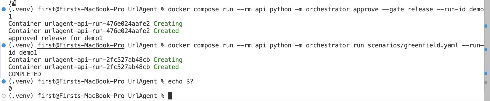

```bash
grep -E 'waiting_release|gate_approved|run_completed' runs/demo1/trace.jsonl
```

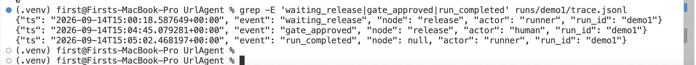

The trace event is `gate_approved` with `actor` set to `human`, not `approved`. No code path sets an
approval; only the explicit approve command records one.

Full write-up: [docs/operations/greenfield-demo1.md](docs/operations/greenfield-demo1.md)

## Brownfield (~1 min)

The brownfield run produces `impact.md` before any patch is written. It lists the files the change
is allowed to touch. The change itself adds 410 Gone for expired links and 429 after 10 POSTs in 60
seconds.

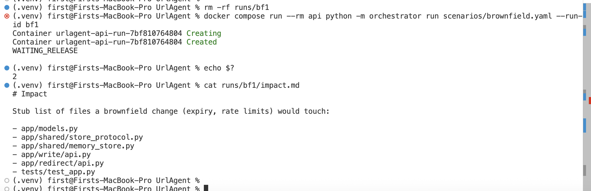

Full write-up: [docs/operations/brownfield-bf1.md](docs/operations/brownfield-bf1.md)

## Ambiguous (~1 min)

The ambiguous scenario stops at WAIT_ANSWERS instead of guessing. `answers.json` is written by the
human, and records three decisions: persistence is memory, auth is none, and "reliable" means
tests_and_validation_not_multi_region. Approving the answers gate lets the run finish as COMPLETED.
This path has no release gate.

```bash
docker compose run --rm api python -m orchestrator run scenarios/ambiguous.yaml --run-id amb1
# answers.json is written by the human into runs/amb1/
docker compose run --rm api python -m orchestrator approve --gate answers --run-id amb1
docker compose run --rm api python -m orchestrator run scenarios/ambiguous.yaml --run-id amb1
```

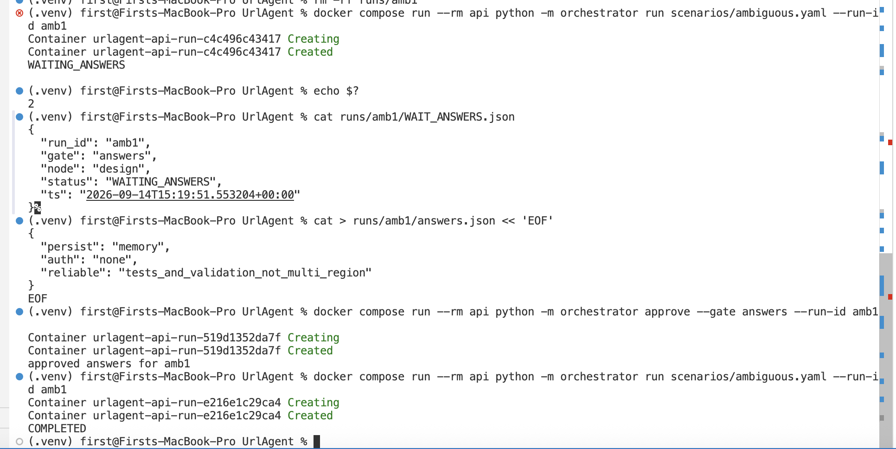

Full write-up: [docs/operations/ambiuguos-amb1.md](docs/operations/ambiuguos-amb1.md)

## Tests and CI (~30 sec)

```bash
docker compose run --rm api pytest -q
```

The result is 8 passed. Two Starlette deprecation warnings about `TestClient` and `httpx` also
appear. They are expected and do not affect the result.

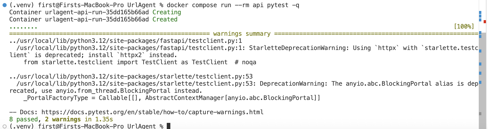

CI runs the same build and the same pytest command on every push and pull request. No secrets are
required.

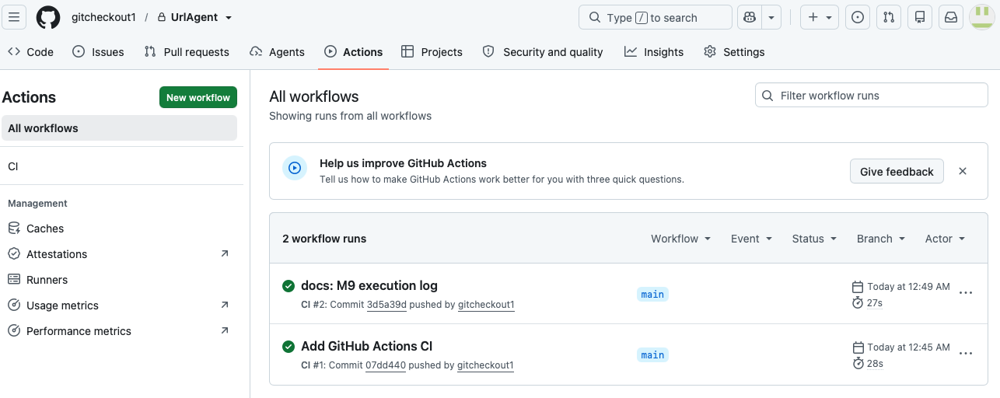

## If something breaks

- Port 8000 already in use: stop the process holding it, or change the host port in
  `docker-compose.yml`.
- A run that stopped at a gate: approve the gate, then run again with the same `--run-id`. The run
  resumes and skips finished nodes. Starting a new run id restarts from the beginning.
- Swagger redirect fails on an external URL: use the `curl` command from Moment 1, or paste the
  short URL into the address bar.

## Read more

- [README.md](README.md) — Docker and orchestrator commands
- [SUMMARY.md](SUMMARY.md) — assumptions and limitations (repo root)
- [docs/architecture.md](docs/architecture.md) — app and orchestrator layout
- [docs/agent.md](docs/agent.md) — gates, and the split between human and agent
- [docs/execution.md](docs/execution.md) — milestone log with commits and errors
- `runs/demo1/SUMMARY.md` — per-run metrics (duration, retries, success) after a completed demo1
