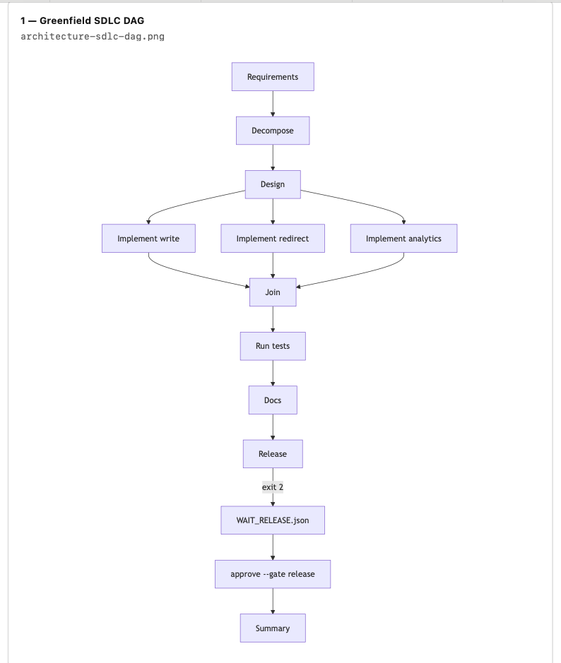

# UrlAgent
 
FastAPI URL shortener + a small SDLC orchestrator written in Python. HITL (Human in the Loop) approves release (and answers on ambiguous runs). Not LangGraph, not a chat UI.
 
## Run it (Docker)
 
```bash
git clone https://github.com/gitcheckout1/UrlAgent.git
cd UrlAgent
docker compose up --build
```
 
- Docs: http://localhost:8000/docs
- Health: http://localhost:8000/health

- `POST /v1/urls` returns **201 Created** with a short `code`
 
 
Tests in container:
 
```bash
docker compose run --rm api pytest -q
```
 
Last run: **8 passed**. CI on GitHub Actions — same compose + pytest on push: https://github.com/gitcheckout1/UrlAgent/actions
 
## Orchestrator quick check
 
```bash
docker compose run --rm api python -m orchestrator run scenarios/greenfield.yaml --run-id demo1
docker compose run --rm api python -m orchestrator approve --gate release --run-id demo1
docker compose run --rm api python -m orchestrator run scenarios/greenfield.yaml --run-id demo1
```
 
First run exits **2** (`WAITING_RELEASE`). After approval, second run exits **0**.
 
Brownfield and ambiguous runs — see `docs/operations/`.
 
## What's in the repo
 
- `app/` — write, redirect, analytics (modular monolith, one process)
- `data/` — SQLite URL store in Docker (`./data/urls.db`; gitignored)
- `orchestrator/` — DAG, runner, gates, CLI
- `scenarios/` — greenfield, brownfield, ambiguous
- `tests/` — app + orchestrator
- `docs/` — scope, architecture, agent rules, execution log, operation proofs, screenshots


 
Scope: [docs/v1-scope.md](docs/v1-scope.md)  
Architecture: [docs/architecture.md](docs/architecture.md)
 

 
HITL / policy: [docs/agent.md](docs/agent.md)  
Build log: [docs/execution.md](docs/execution.md)  
Scenario runs: [docs/operations/](docs/operations/) — `greenfield-demo1.md`, `brownfield-bf1.md`, `ambiuguos-amb1.md`
Summary: [SUMMARY.md](SUMMARY.md)  
Demo walkthrough (screenshots in `docs/screenshots/`): [DEMO.md](DEMO.md)
 
## Human vs Cursor
 
Cursor drafts code from milestone prompts. I review the diff, run pytest, run the three scenarios, and type the docs. I run `approve --gate release` (and write `answers.json` for ambiguous). Code never sets `approvals.release` on its own.
 
## Tests map (rough)
 
| Area | What it does | Tests |
|------|----------------|-------|
| write | POST /v1/urls, 429 after 10/min | create, bad scheme, 11th POST |
| redirect | GET /{code}, 410 if expired | redirect, expiry |
| analytics | GET stats | stats |
| shared | UrlStore — memory in tests, SQLite in Docker | via test_app |
| orchestrator | DAG + gates + trace | test_orchestrator (3 tests) |
 
## Logs and traces
 
- App: INFO on stdout
- Each run: `runs/<run-id>/trace.jsonl` — node events, `waiting_release`, `gate_approved` (actor `human`), `run_completed`, rollbacks
- Each run: `runs/<run-id>/SUMMARY.md` with duration_s, retries, rollbacks, success, mttr_s
- `runs/` and `data/` are gitignored — local only
 
## API quirks
 
- Create links and stats: use `/docs` (POST -> 201)
- Redirect: open `http://localhost:8000/<code>` in the browser. Swagger often looks stuck on GET redirect — that's the 302, use the browser or:
 
```bash
curl -s -D - -o /dev/null --max-redirs 0 http://127.0.0.1:8000/<code>
```
 
## Limits (short version)
 
No auth, no Redis, no k8s, no HITL web UI. Rate limit is per-process not per-IP. Ambiguous scenario stops for `answers.json` once — no full re-plan loop. Details in [SUMMARY.md](SUMMARY.md).