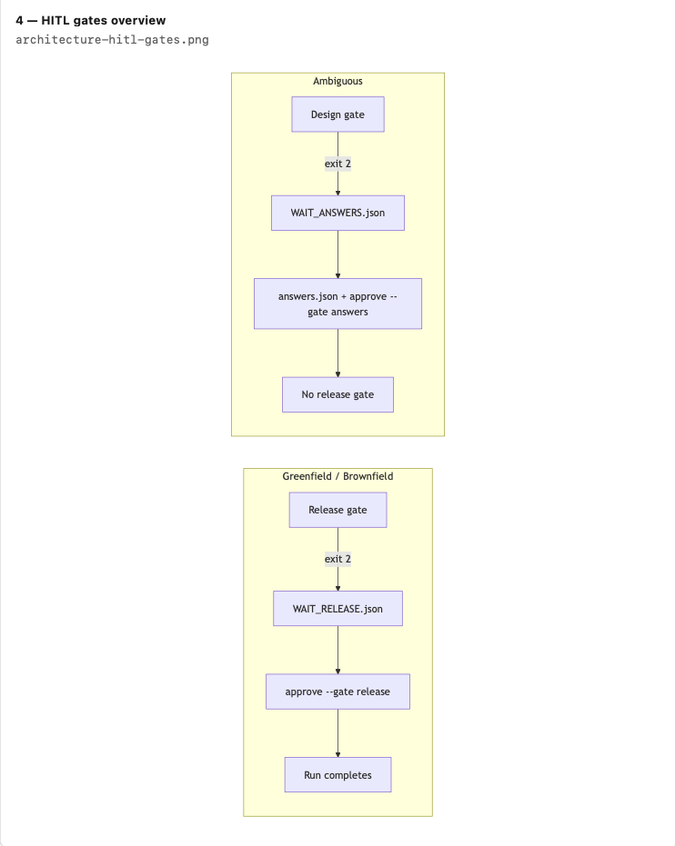

# Agent & HITL Model

## Cursor P0 rules
- only files I name.  No Redis/k8s/LangGraph unless I ask.
- Never set approvals.release in code.
- Ambiguous -> stop for human answers.

## Human vs agent (draft)
|Action | Agent | Me | 
|-------|-------|------|
|Draft code | yes | review diff |
|approve --gate release | no | yes |
|answers.json | no | yes |

## Gates (humans are not worker nodes)

| Gate | When | Human action |
|------|------|----------------|
| release | Before summary on greenfield/brownfield | `approve --gate release --run-id ID` |
| answers | Ambiguous, no answers.json | Write answers.json + `approve --gate answers` |

Runner writes WAIT_RELEASE.json or WAIT_ANSWERS.json and exits 2.

## Policy
safe_write allows: app/, tests/, docs/, scenarios/, runs/
Denies: .env, paths with ..

## Security
- http/https URLs only; reject javascript: etc.
- No server-side fetch of target URLs
- Secrets in env only; never log tokens or full URLs

## Retry and rollback
- Snapshot app/ to runs/<run-id>/snapshot/ before first implement_* node (once per run, not on retry)
- Test node runs real `pytest -q tests/test_app.py` (scoped to app tests, not orchestrator tests)
- On failure: restore snapshot, increment rollback_count in state + trace
- Max 2 test attempts (1 retry), then STOPPED (exit 1)
 
## Metrics
Written to runs/<run-id>/SUMMARY.md: duration_s, retry_count, rollback_count, success, mttr_s (or N/A).
Also emitted as `summary_metrics` in trace.jsonl.
Human wait at release/answers gates is excluded from duration_s and is not MTTR.

