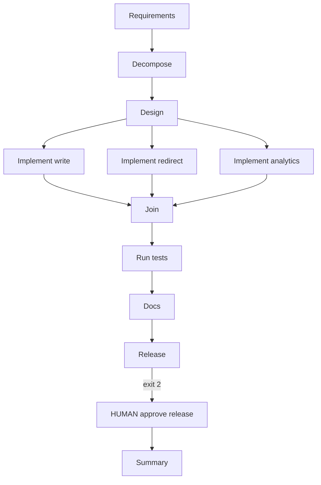

# Architecture

## Application (one process)

```
                 +------------------+
                 |   app/main.py    |
                 +--------+---------+
                          |
    +---------------------+---------------------+
    |                     |                     |
 app/write           app/redirect          app/analytics
 POST /v1/urls       GET /{code}            GET .../stats
    |                     |                     |
    +---------------------+---------------------+
                          |
                 app/shared (UrlStore)
```

Store: in-memory for M2; SQLite in M7.

## SDLC orchestration graph



Brownfield: insert **impact** after design, then implement nodes run after impact.
Ambiguous: only req → decompose → design. stops after design ( no implement/join/release/summary path)

## Run artifacts
- runs/<id>/state.json — node_status, approvals
- runs/<id>/trace.jsonl — audit log (one JSON per line)

CLI exit codes: 0 done, 2 waiting human, 1 failed.
