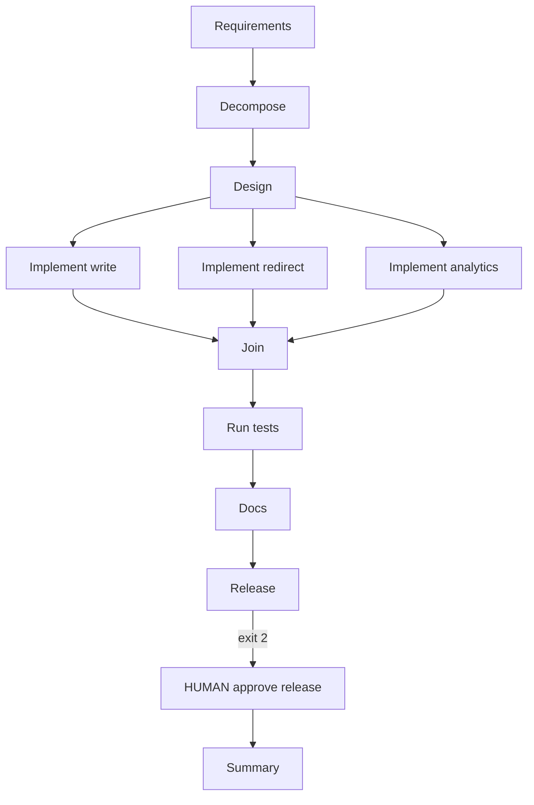

# Architecture

## Application (one process)

```
                 +------------------+
                 |   app/main.py    |
                 +--------+---------+
                          |
    +---------------------+---------------------+
    |                     |                     |
 app/write           app/redirect          app/analytics
 POST /v1/urls       GET /{code}            GET .../stats
    |                     |                     |
    +---------------------+---------------------+
                          |
                 app/shared (UrlStore)
```

Store: in-memory for M2; SQLite in M7.

## SDLC orchestration graph



Brownfield: insert **impact** after design, then implement nodes run after impact.
Ambiguous: only req → decompose → design. stops after design ( no implement/join/release/summary path)

## Run artifacts
- runs/<id>/state.json — node_status, approvals
- runs/<id>/trace.jsonl — audit log (one JSON per line)

CLI exit codes: 0 done, 2 waiting human, 1 failed.

## Brownfield behavior (product)

- `expires_at = created_at + 24h`; expired GET `/{code}` → 410 Gone (no click increment)

- Rate limit: 10 POST `/v1/urls` per 60s per process → 429; global window, not per-IP

- `impact.md` lists files before patch; stats endpoint unchanged on expiry
 

 ## Persistence

- `UrlStore` protocol; implementations: in-memory (tests) and SQLite (`./data/urls.db`)

- `DATABASE_URL=sqlite:///./data/urls.db` selects SQLite; unset → memory

- `data/` created when SQLite store is first used (lazy init)

- Trade-off: simple single-file durability; not multi-instance without shared DB
 
 ## Deployment (Docker)
 - `docker compose up --build` → api on :8000
 - Volumes: ./data (SQLite), ./runs (orchestrator artifacts)
 - Health: GET /health → {"status":"ok"}
 - Same image runs uvicorn and `python -m orchestrator` via compose run
 - Container binds `0.0.0.0:8000`; access from host at `http://localhost:8000`

## CI Enable (GitHub Actions)
- CI: GitHub Actions runs `docker compose build` and `pytest -q` on push/PR
