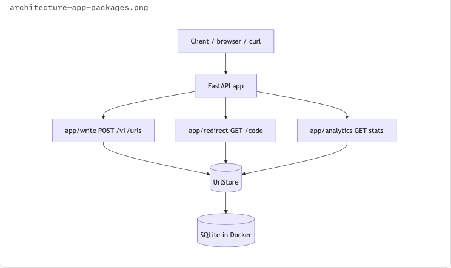
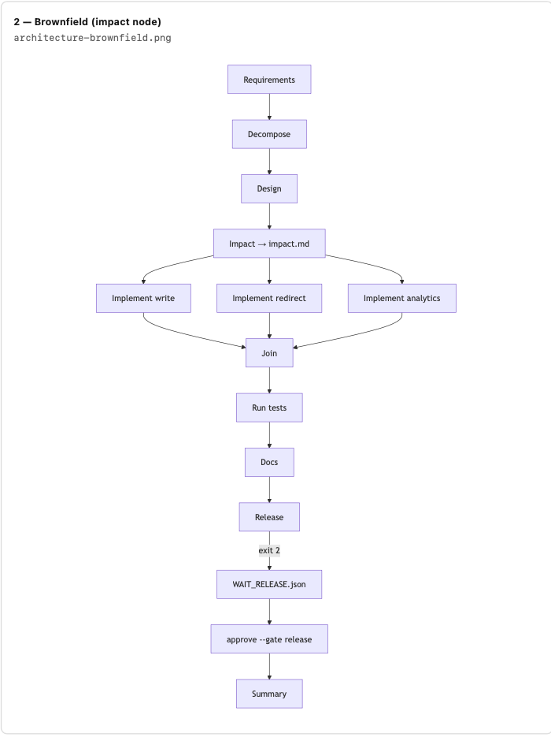
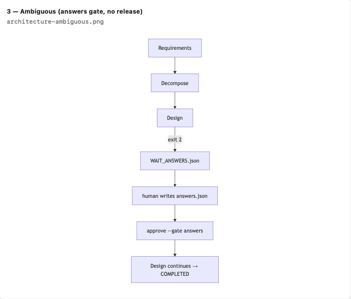

# Architecture
 
## Application (one process)
 
Modular monolith: one FastAPI process, three route packages, shared `UrlStore`. Tests use in-memory store; Docker uses SQLite (`./data/urls.db`).
 

 
## SDLC orchestration graph
 
Greenfield: requirements through summary, with human approval before release completes.
 

 
## Brownfield (orchestrator)
 
`impact` node runs after design and writes `impact.md` (file allowlist) before any patch. Then the same implement → join → test → docs → release path as greenfield.
 

 
## Ambiguous (orchestrator)
 
Short path: req → decompose → design → `WAIT_ANSWERS` (exit **2**). Human writes `answers.json` and approves the answers gate. No implement/join/release gate on this scenario.
 

 
HITL gate overview (release vs answers): see [docs/agent.md](agent.md).
 
## Run artifacts
 
- `runs/<id>/state.json` — node_status, approvals
- `runs/<id>/trace.jsonl` — audit log (one JSON per line); events include `waiting_release`, `gate_approved`, `run_completed`
 
CLI exit codes: **0** done, **2** waiting human, **1** failed.
 
## Brownfield behavior (product)
 
- `expires_at = created_at + 24h`; expired GET `/{code}` → **410 Gone** (no click increment)
- Rate limit: 10 POST `/v1/urls` per 60s per process → **429**; global window, not per-IP
- `impact.md` lists files before patch; stats endpoint unchanged on expiry
 
## Persistence
 
- `UrlStore` protocol; implementations: in-memory (tests) and SQLite (`./data/urls.db`)
- `DATABASE_URL=sqlite:///./data/urls.db` selects SQLite; unset → memory
- `data/` created when SQLite store is first used (lazy init)
- Trade-off: simple single-file durability; not multi-instance without shared DB
 
## Deployment (Docker)
 
- `docker compose up --build` → api on :8000
- Volumes: `./data` (SQLite), `./runs` (orchestrator artifacts)
- Health: GET `/health` → `{"status":"ok"}`
- Same image runs uvicorn and `python -m orchestrator` via `compose run`
- Container binds `0.0.0.0:8000`; access from host at `http://localhost:8000`
 
## CI (GitHub Actions)
 
- Runs `docker compose build` and `pytest -q` on push/PR
- https://github.com/gitcheckout1/UrlAgent/actions